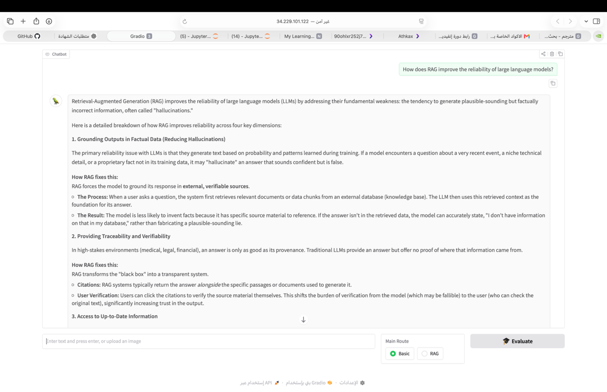

# RAG Document Chatbot

A document question-answering chatbot built using Retrieval-Augmented Generation (RAG).

The project allows users to add their own PDF documents, build a searchable vector index, retrieve relevant document content, and generate answers based on the retrieved context.



---

## Project Overview

This project implements a practical RAG pipeline for document-based question answering.

Instead of relying only on the language model's internal knowledge, the system retrieves relevant information from the user's documents and provides that context to the language model before generating an answer.

### RAG Workflow

```text
PDF Documents
      ↓
Document Processing
      ↓
Embeddings
      ↓
FAISS Vector Store
      ↓
Semantic Retrieval
      ↓
Relevant Document Context
      ↓
LLM
      ↓
Generated Answer

Features
PDF document ingestion
Document embeddings
Semantic similarity search
FAISS vector store
Retrieval-Augmented Generation (RAG)
Context-based question answering
FastAPI backend
NVIDIA-compatible LLM integration
Configurable document collection
Local vector index generation
Technologies
Python
LangChain
FAISS
FastAPI
NVIDIA AI Endpoints
NVIDIA NIM-compatible models
PyMuPDF
Pydantic

rag-document-chatbot/
│
├── app/
│   ├── rag_pipeline.py
│   └── server.py
│
├── assets/
│   └── rag-agent-demo.png
│
├── data/
│   └── README.md
│
├── scripts/
│   └── build_index.py
│
├── .env.example
├── .gitignore
├── README.md
└── requirements.txt

Training & Practical Application
This project was developed as a practical application of concepts learned through NVIDIA Deep Learning Institute (DLI) training in Building RAG Agents with LLMs.
The training covered concepts including:

Embeddings
Vector stores
Semantic retrieval
Retrieval-Augmented Generation
LangChain runnable pipelines
Document-based chatbots
RAG evaluation concepts
LLM integration
The repository presents a standalone project structure based on these concepts rather than including the NVIDIA DLI course notebooks, course solutions, or course-provided document index.
Setup
1. Clone the repository
git clone https://github.com/ghalaxqahtani/rag-document-chatbot.git
cd rag-document-chatbot
2. Create a virtual environment
python -m venv .venv
Activate it:
macOS / Linux

source .venv/bin/activate
Windows
.venv\Scripts\activate
3. Install dependencies
pip install -r requirements.txt
4. Configure the NVIDIA API key
Copy .env.example to .env:
cp .env.example .env
Then add your NVIDIA API key:
NVIDIA_API_KEY=your_nvidia_api_key_here
Do not commit your actual API key to GitHub.
Adding Documents
Place your own PDF files inside:
data/
The repository intentionally does not include NVIDIA DLI course documents or a course-provided vector index.
Build the Vector Index
After adding your PDF documents, run:
python scripts/build_index.py
This creates the local FAISS index used by the retrieval pipeline.
The generated vector index is intentionally excluded from Git tracking.

Run the API
Start the FastAPI server with:
uvicorn app.server:app --reload
The API can then be accessed locally through:
http://127.0.0.1:8000
The health endpoint is:
GET /health
How It Works
When a user submits a question:
The question is converted into an embedding.
FAISS searches the document vector index for semantically relevant content.
The most relevant document chunks are retrieved.
The retrieved context is passed to the language model.
The model generates an answer based on the available document context.
This approach helps the chatbot answer questions using information contained in the user's documents.
Data and Privacy
User-provided documents are not included in this repository.
The repository also excludes:

PDF documents
FAISS indexes
Pickle files
Environment files
API keys
See .gitignore for the complete list of excluded files.
Learning Outcome
Through this project, I applied practical concepts related to:
Large Language Models
Retrieval-Augmented Generation
Vector databases
Embeddings
Semantic search
LangChain
API development
AI application development
The project demonstrates the transition from learning RAG concepts to implementing a structured, reusable document-question-answering application.
