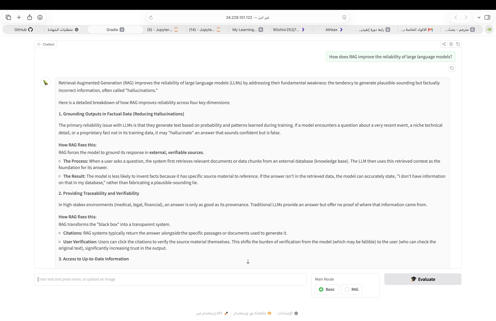

# RAG AI Agent

A Retrieval-Augmented Generation (RAG) AI agent built with Python, LangChain, FAISS, FastAPI, and LangServe.

## Overview

This project demonstrates a document-based AI agent that retrieves relevant information from a vector store and uses a Large Language Model (LLM) to generate conversational responses based on the retrieved context.

The system was developed and tested as part of the NVIDIA Deep Learning Institute course:

**Building RAG Agents with LLMs**

## Features

- Retrieval-Augmented Generation (RAG)
- Document retrieval using FAISS
- Semantic similarity search
- LLM-powered response generation
- Conversational document chatbot
- Conversation memory
- Long-context document reordering
- FastAPI API server
- LangServe endpoints
- Gradio-based web interface for testing

## Architecture

The main workflow is:

User Question  
↓  
Document Retrieval  
↓  
Relevant Context  
↓  
LLM  
↓  
Generated Answer

The agent also maintains conversation history to support interactions across multiple turns.

## Technologies

- Python
- LangChain
- FAISS
- FastAPI
- LangServe
- Gradio
- Large Language Models (LLMs)
- Vector Embeddings
- Retrieval-Augmented Generation (RAG)

## API Endpoints

The server exposes the following LangServe endpoints:

- `/basic_chat` — basic LLM interaction
- `/retriever` — retrieves relevant documents from the vector store
- `/generator` — generates an answer using the retrieved context

## Project Files

| File | Description |
|---|---|
| `07_vectorstores.ipynb` | Notebook containing the RAG retrieval and conversational agent implementation |
| `server_app.py` | FastAPI/LangServe server with chat, retrieval, and generation endpoints |
| `rag-agent-demo.png` | Screenshot of the web-based RAG agent demonstration |

## Demo

The RAG agent was tested through a web-based Gradio interface.

## Learning Outcome

Through this project, I practiced building an end-to-end RAG application, including document processing, vector retrieval, conversational memory, prompt construction, LLM integration, and API deployment.

## Certification

Completed the NVIDIA Deep Learning Institute course:

**Building RAG Agents with LLMs**

Certificate of Competency — NVIDIA DLI.

